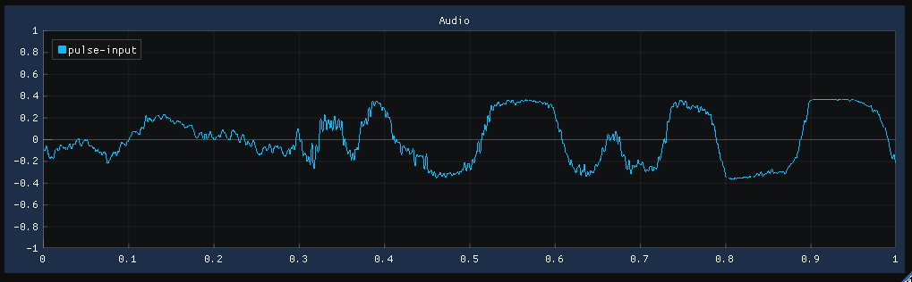

# implot binding

This project contains Haskell bindings to the
[dear-imgui](https://github.com/ocornut/imgui)
[implot](https://github.com/epezent/implot) project.

The [demo](./Main.hs) shows a LinePlot of a pulseaudio input:



## Contribute

To build the project and the demo, make sure these projects are cloned:

- ./github.com/haskell-game/dear-imgui.hs/
- ./github.com/TristanCacqueray/pipes-pulse-simple/
- ./github.com/TristanCacqueray/dear-implot.hs/

Then run:

```ShellSession
$ cabal build
$ cabal run test
```
